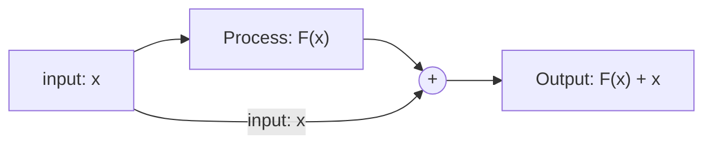

Title: Notes for Deep Learning
Slug: 
Date: 2018-04-28 09:00
Category: python
Tags: python, deep-learning, Keras
Author: h1r03
Summary: Notes for Deep Learning

# Notes for Deep Learning

## Grocery

LSTM: Long-Short Term Memory networks [link](http://colah.github.io/posts/2015-08-Understanding-LSTMs/) 

RNN: Recurrent Neural Network

Vanilla NN: 

* "Vanilla" refers to the name given to the standard backpropagation algorithm [source](https://www.quora.com/What-is-the-vanilla-neural-network-Is-it-just-an-alias-for-a-feedforward-neural-network)
* "Vanilla" is a common euphemism for "regular" or "without any fancy stuff." 

 Max pooling: sample-based discretization process [quora](https://www.quora.com/What-is-max-pooling-in-convolutional-neural-networks)

* in other words, downsampling across time
* pool_size: window size
* strides: interval / overlap size
* padding: valid = only processing non-na data points, same = return the same size

Dense:  densely-connected NN [Keras Documentation - Core Layers](https://keras.io/layers/core/)

> `Dense` implements the operation: `output = activation(dot(input, kernel) + bias)` where `activation` is the element-wise activation function passed as the `activation` argument, `kernel` is a weights matrix created by the layer, and `bias` is a bias vector created by the layer (only applicable if `use_bias` is `True`).

Activation: activation layer [Activations](https://keras.io/activations/) 

* softmax

* elu: Exponential Linear Unit
  $$
  \begin{equation}f(x) =  \alpha  (e^{x} - 1)   \quad for \quad x < 0 \end{equation}
  $$
$$x^2$$
* selu: Scaled Exponential Linear Unit

* softplus

* softsign 

* relu: Rectified Linear Unit

  $$
  \begin{equation}f(x) = x^{+} = max(0, x) \end{equation}
  $$

* tanh

* sigmoid 

* hard_sigmoid

* PReLu (advanced activations [link](https://keras.io/layers/advanced-activations/)): Parametric Rectified Linear Unit

Dropout: avoid the problem of overfitting

Deep Learning Libraries:

* Theano: python library 
* Tensorflow: 

## Deep Learning Architecture

* Residual Networks

Residual Networks (ResNet) is the architecture that uses the shortcut path to add input $x$ to a processing block as $F(x) + x$ as below. 

## Visualization

* plot_model()

1. Install **graphviz** Python package, and the graphviz binaries added to the PATH.
2. Install **pydot** Python package
3. Fix a bug in the Visualization module in Keras

## Steps to prepare dataset

1. Dataset Preparation 
   1. turn your data into sequences of data frames
   2. each dadtaframe should have output label
2. Design Network
   1. input layer: same size of input vectors
   2. output layer: depends of what you need at the end
   3. Fully Connected Layer 
   4. LSTM later 
      1. tips: start with small layers​

# Word Embedding

https://blog.keras.io/using-pre-trained-word-embeddings-in-a-keras-model.html

small example of word embedding

https://machinelearningmastery.com/use-word-embedding-layers-deep-learning-keras/

Pre-training

GloVe: Global Vectors for Word Representation - [link](https://nlp.stanford.edu/projects/glove/)

adam: A method for Stochastic Optimization - [link](http://arxiv.org/abs/1412.6980)

How to check tensorflow using gpu or cpu

https://stackoverflow.com/questions/38009682/how-to-tell-if-tensorflow-is-using-gpu-acceleration-from-inside-python-shell

## Learning Rate

Author: Leslie Smith

Technique: Pesky learning rate

Paper:  [arxiv](https://arxiv.org/abs/1803.09820)

stop the learnig rate before the minmum loss since the optimal point is acutally too much and can be oscilated. 

Other technique:  [adam (adaptive moment estimation)](https://machinelearningmastery.com/adam-optimization-algorithm-for-deep-learning/)

